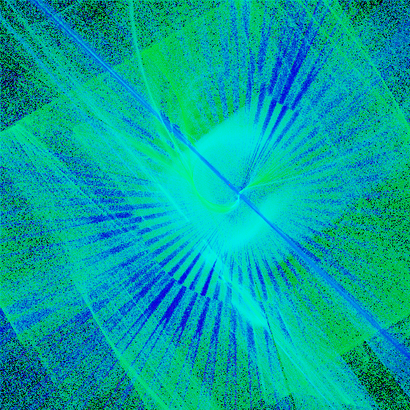
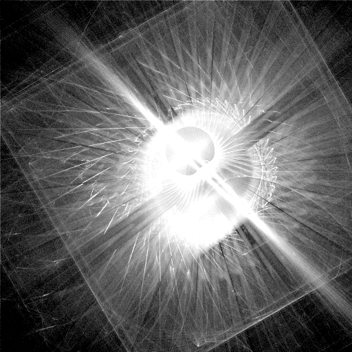
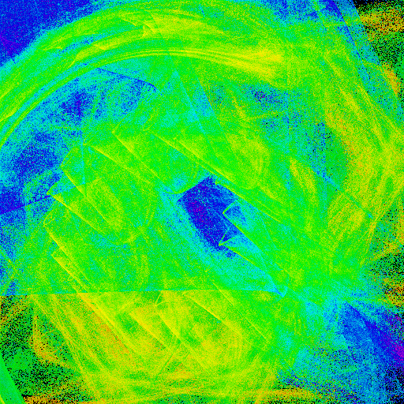
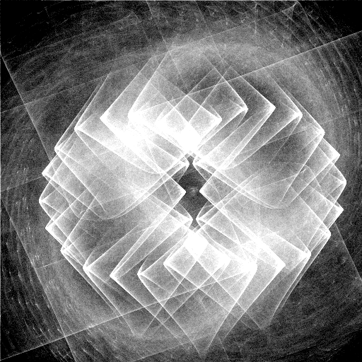

# Canonical Examples: Bottom-Tier-By-CNN-But-Actually-Good

A standing set of genomes that the current CNN scorer rates in its lowest
percentile but that human inspection rates as legitimately good. Used as
fixed eval anchors for any future scoring-model iteration: a successful
iteration should move these genomes UP in the score ranking, not just
nudge aggregate val_acc.

Filed 2026-05-20 during the wrong-sign-on-S investigation.

## Why these examples matter

The current CNN scorer (`flame_sheep/data/cnn_scorer_personal_vk.npz`,
norm=v3) shows two failure modes against thumbs-up data:

1. **Bottom-percentile but human-good**: genomes with strong composition,
   symmetry, and coherent motion get ranked in the bottom 1% by CNN.
2. **Wrong-sign on S channel**: ablation studies (`tools/ablate_cnn_channels.py`)
   show val_acc *improves* by +1.6pp when the S channel is zeroed — the model
   is using S in a way that hurts ranking, not just ignoring it.

The hypothesis that ties these together: structured S (the spirograph/swirl
patterns from coherent affine-rotation dynamics) is what makes some bottom-tier
genomes beautiful, but the model penalizes structured S — possibly because
earlier training rounds had broken renders (convergent attractors, pulsars)
whose S also looked "structured" by intensity-only metrics. The model learned
"S structure = bad" and now penalizes the cases where S structure is actually
the visual signature of beautiful drifting motion.

The S channel as a representation can't distinguish "stable structure under
rotation" from "many overlapping things smeared together" — both produce
bright pixels in the same place. Even a human watching the smear (without
seeing it animated live) struggles to tell them apart.

## The examples

### Genome #2456 — radial filament composition

| | |
|---|---|
| CNN score | 1.682 |
| Percentile | 0.5% (bottom) |
| Status | thumbs-up'd 2026-05-20, gen 1; children 2538–2544 |

What the human sees: clean bilateral symmetry, strong central focal point,
dense radial filament structure, complementary green/cyan against a dark
field. The S channel is unusually clean for this corpus — bright central
core stays put under rotation, rays sweep around it. From watching it live
(in the wallpaper) you can decompose what's stable from what rotates; that
information is invisible to the CNN, which only sees the static smear.

What the CNN sees / scores low: high edge density across the frame and
the structured S channel. The model probably treats "lots of edges
everywhere" as noise rather than as a deliberate composition, and treats
the coherent S structure as the kind of signature that historically meant
broken renders.

### Genome #127 — geometric pinwheel

| | |
|---|---|
| CNN score | 1.700 |
| Percentile | 0.5% (bottom) |
| Status | thumbs-up'd 2026-05-20, gen 1; children 2545–2551 |

What the human sees: layered overlapping squares producing 8-fold rotational
interlock; intricate geometric structure across multiple scales; visually
striking even as a static image. The S channel shows the cleanest example of
"rotation-stable structure with directional smoke drift" in the corpus —
hard edges release smoke that drifts differently per rotation phase, creating
the outer spiral pattern. The CNN sees the static byproduct (swirly outer
regions) without the directional/temporal information that makes it dynamic.

What the CNN sees / scores low: same wrong-sign-on-S issue. The structured
S channel matches the failure-mode signature; possibly also the heavy
geometric repetition triggers whatever "monoculture penalty" the model has.

## Use as eval anchor

When training a new scoring model (CNN v2, transformer variant, channel
architecture v2, whatever), the pass/fail signal isn't just aggregate val_acc.
Run the new model on the full library and ask:

1. **Did genome 2456 move up?** Currently 0.5th percentile. Target: at least
   above the bottom decile, ideally above median.
2. **Did genome 127 move up?** Same target.
3. **Did the wrong-sign-on-S effect go away?** Re-run `tools/ablate_cnn_channels.py`
   on the new model. The "no_S" delta should be near zero (channel uninformative)
   or negative (channel actually helps). If it's still positive, the wrong-sign
   bug survived.

If a new model fails any of these three, it hasn't actually fixed the failure
mode — even if its aggregate val_acc looks better.

## When to add new canonical examples

Add a new genome to this list when:
- You find another bottom-percentile-by-CNN genome that is visibly good on
  inspection AND illustrates a distinct failure mode (not just "another one
  with structured S")
- A retraining iteration moves the current examples to mid-tier — re-anchor
  at the new bottom

Don't add genomes that just look pretty. The point is *examples that diagnose
specific scorer failures*, not a personal favorites list.
